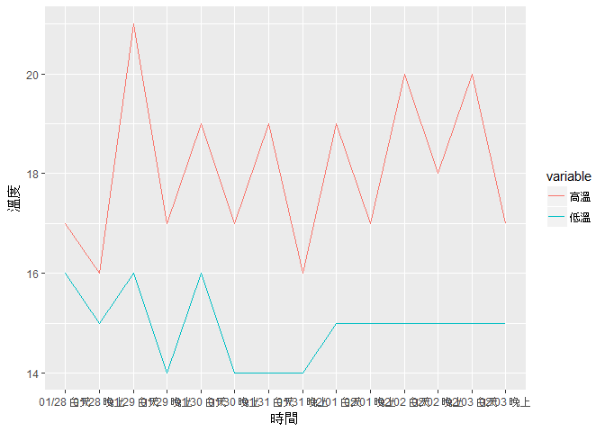

cx+x\_test1
================
王聖義 (Sheng-Yi Wang) sociology4/r02325008
2017年2月23日

``` r
library(dplyr);library(ggplot2); library(reshape2)
```

    ## Warning: package 'dplyr' was built under R version 3.2.4

    ## 
    ## Attaching package: 'dplyr'

    ## The following objects are masked from 'package:stats':
    ## 
    ##     filter, lag

    ## The following objects are masked from 'package:base':
    ## 
    ##     intersect, setdiff, setequal, union

    ## Warning: package 'ggplot2' was built under R version 3.2.5

``` r
x <- read.csv("c:/gra/weather-utf8.csv",fileEncoding="UTF-8")

# 讀入csv後，格式即為dataframe
day1 <- filter(x, 早晚 == "白天")
day2 <- mutate(day1, 溫度 = paste(高溫, "-", 低溫))
day3 <- select(day2, 天氣, 溫度)

night1 <- filter(x, 早晚 == "晚上")
night2 <- mutate(night1, 溫度 = paste(高溫, "-", 低溫))
night3 <- select(night2, 天氣, 溫度)

out <- data.frame(t(bind_cols(day3, night3)))
```

    ## Warning in data.row.names(row.names, rowsi, i): some row.names duplicated:
    ## 3,4 --> row.names NOT used

``` r
colnames(out) <- day1$日期
rownames(out) <- c("白天天氣","白天溫度","晚上天氣","晚上溫度")
out
```

    ##               01/28      01/29      01/30      01/31    02/01   02/02
    ## 白天天氣   陰短暫雨 多雲短暫雨 多雲短暫雨   陰短暫雨 多雲時陰    多雲
    ## 白天溫度    17 - 16    21 - 16    19 - 16    19 - 14  19 - 15 20 - 15
    ## 晚上天氣 多雲短暫雨 多雲短暫雨   陰短暫雨 多雲短暫雨     多雲    多雲
    ## 晚上溫度    16 - 15    17 - 14    17 - 14    16 - 14  17 - 15 18 - 15
    ##            02/03
    ## 白天天氣    多雲
    ## 白天溫度 20 - 15
    ## 晚上天氣    多雲
    ## 晚上溫度 17 - 15

``` r
x1 <- mutate(x, 時間=paste(日期,早晚))
x2 <- select(x1, 時間, 高溫, 低溫)
x3 <- melt(x2)
```

    ## Using 時間 as id variables

``` r
g <- ggplot(x3, aes(x=時間, y=value, group=variable, colour=variable)) + 
  geom_line() + 
  labs(x="時間", y="溫度") 
g
```


